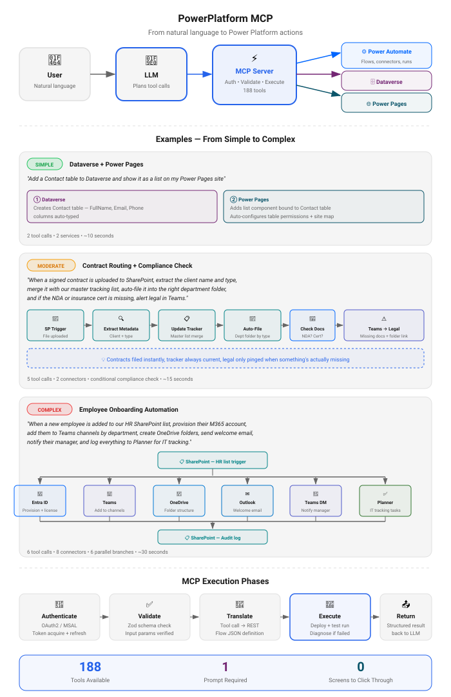

# Power Automate MCP Server

**Docs:** **Overview** · [Installation & Upgrading](https://github.com/rcb0727/powerautomate-mcp-docs/blob/main/INSTALL.md) · [Changelog](https://github.com/rcb0727/powerautomate-mcp-docs/blob/main/CHANGELOG.md) · [Report an issue](https://github.com/rcb0727/powerautomate-mcp-docs/issues)

An MCP (Model Context Protocol) server for Microsoft Power Automate. Create, manage, and deploy Power Automate flows using natural language.

Works with any MCP-compatible AI client: **Claude Desktop**, **Claude Code**, **VS Code Copilot**, **Cursor**, **Google Gemini CLI**, and more.

## Documentation Map

| Page | What you'll find |
|------|------------------|
| **README** (this page) | [Features](#features) · [Quick Start](#quick-start) · [App Registration](#microsoft-entra-app-registration) · [CLI Reference](#cli-reference) · [How It Works](#how-it-works) · [All 121 Tools](#available-tools-121-total) · [Security](#security) · [Architecture](#architecture) |
| [Installation Guide](https://github.com/rcb0727/powerautomate-mcp-docs/blob/main/INSTALL.md) | [Prerequisites](https://github.com/rcb0727/powerautomate-mcp-docs/blob/main/INSTALL.md#prerequisites) · [Install](https://github.com/rcb0727/powerautomate-mcp-docs/blob/main/INSTALL.md#install-from-npm) · [**Updating safely**](https://github.com/rcb0727/powerautomate-mcp-docs/blob/main/INSTALL.md#updating) · per-client setup ([Claude Desktop](https://github.com/rcb0727/powerautomate-mcp-docs/blob/main/INSTALL.md#claude-desktop), [Claude Code](https://github.com/rcb0727/powerautomate-mcp-docs/blob/main/INSTALL.md#claude-code-cli), [VS Code](https://github.com/rcb0727/powerautomate-mcp-docs/blob/main/INSTALL.md#vs-code-github-copilot), [Cursor](https://github.com/rcb0727/powerautomate-mcp-docs/blob/main/INSTALL.md#cursor), [Gemini CLI](https://github.com/rcb0727/powerautomate-mcp-docs/blob/main/INSTALL.md#google-gemini-cli), [ChatGPT](https://github.com/rcb0727/powerautomate-mcp-docs/blob/main/INSTALL.md#chatgpt-openai)) · [Enterprise consent](https://github.com/rcb0727/powerautomate-mcp-docs/blob/main/INSTALL.md#enterprise-tenants-with-strict-consent-policies) |
| [Changelog](https://github.com/rcb0727/powerautomate-mcp-docs/blob/main/CHANGELOG.md) | Release history with per-version upgrade notes |
| [Issues](https://github.com/rcb0727/powerautomate-mcp-docs/issues) | Bug reports and feature requests — every one gets read |

## Features

- **Create Flows** - Build flows from natural language descriptions with guided wizard
- **Test & Debug** - Automatic testing with intelligent error diagnosis
- **Validate** - Pre-flight checks with best practices scoring (0-100)
- **Manage Flows** - List, update, clone, and delete flows
- **Power Apps** - Manage canvas and model-driven apps, permissions, versions
- **Power Pages** - Configure sites (pages, web roles, table permissions, snippets, templates) and manage hosting (provision, restart, delete)
- **Environment Admin** - Create, copy, backup, restore environments
- **DLP Policies** - Create and manage data loss prevention policies
- **Solutions ALM** - Export, import, and manage Dataverse solutions
- **Dataverse CRUD** - Full table/row operations via OData Web API
- **SharePoint** - Sites, lists, items, and files via Microsoft Graph
- **Expression Help** - Interactive Power Automate expression reference
- **Connector Intelligence** - Full knowledge of 400+ connectors and schemas
- **Cross-Platform** - Works on Windows, macOS, and Linux

## Quick Start

```bash
npm install -g powerautomate-mcp
powerautomate-mcp --setup
```

The setup wizard handles everything automatically:
1. Creates the app registration in your tenant via Azure CLI (or prompts you to provide one)
2. Opens your browser to sign in
3. Presents the admin consent URL (auto-opens in browser)
4. Discovers your environments and lets you select one
5. Saves your configuration

Then configure your AI client. See the **[Installation Guide](https://github.com/rcb0727/powerautomate-mcp-docs/blob/main/INSTALL.md)** for platform-specific setup:

| Client | Config |
|--------|--------|
| Claude Desktop | `claude_desktop_config.json` |
| Claude Code | `claude mcp add powerautomate` |
| VS Code Copilot | `.vscode/mcp.json` |
| Cursor | `~/.cursor/mcp.json` |
| Gemini CLI | `~/.gemini/settings.json` |
| ChatGPT | `--http` flag + tunnel (see [guide](https://github.com/rcb0727/powerautomate-mcp-docs/blob/main/INSTALL.md#chatgpt-openai)) |

---

## Microsoft Entra App Registration

The setup wizard (`--setup`) creates the app registration automatically if you have Azure CLI installed. No manual steps required for most users.

### Who Needs to Do What?

| Role | Action |
|------|--------|
| Entra ID admin with Azure CLI | Run `powerautomate-mcp --setup` — everything is automated |
| Entra ID admin without Azure CLI | Run `--setup`, paste your app's Client ID when prompted, grant admin consent |
| Non-admin user | Run `--setup`, then ask an admin (see roles below) to approve the consent URL shown |
| End users (after admin setup) | Just run `powerautomate-mcp --setup` |

> **Tip:** You can also set `PA_MCP_CLIENT_ID` as an environment variable to skip the prompt entirely.

### Admin Consent

The setup wizard presents the admin consent URL and auto-opens it in your browser. Any of these Entra ID roles can grant consent: **Global Administrator**, **Application Administrator**, **Cloud Application Administrator**, or **Privileged Role Administrator**. If you don't have one of these roles, share the URL with your admin:

```
https://login.microsoftonline.com/{tenant-id}/adminconsent?client_id=YOUR_CLIENT_ID
```

### Manual Setup (Optional)

If you prefer to create the app registration manually:

1. Go to [Azure Portal](https://portal.azure.com) > **Microsoft Entra ID** > **App registrations** > **New registration**

2. Configure basic settings:
   - **Name**: `Power Automate MCP`
   - **Supported account types**: Accounts in any organizational directory (multi-tenant)
   - **Redirect URI**: Select "Public client/native" and enter:
     ```
     https://login.microsoftonline.com/common/oauth2/nativeclient
     ```

3. After creation, go to **Authentication** and enable:
   - **Allow public client flows**: Yes

4. Go to **API permissions** > **Add a permission** and add:

   | API | Permission | Type | Used For |
   |-----|------------|------|----------|
   | Microsoft Graph | `User.Read` | Delegated | User profile |
   | Microsoft Graph | `Sites.ReadWrite.All` | Delegated | SharePoint sites, lists, files |
   | Microsoft Graph | `Files.ReadWrite.All` | Delegated | OneDrive/SharePoint file operations |
   | Power Automate (Flow Service) | `Flows.Read.All` | Delegated | Read flows |
   | Power Automate (Flow Service) | `Flows.Manage.All` | Delegated | Create/update/delete flows |
   | Power Automate (Flow Service) | `Activity.Read.All` | Delegated | Flow run history |
   | Power Automate (Flow Service) | `Approvals.Manage.All` | Delegated | Approval management |
   | Dynamics CRM | `user_impersonation` | Delegated | Dataverse table/row CRUD |
   | Power Platform API | delegated permission | Delegated | Power Pages **site management** (Tier 2 — optional; see note below) |

   > **Power Pages site-management tools (Tier 2)** call `https://api.powerplatform.com` and need the "Power Platform API" delegated permission (appId `8578e004-a5c6-46e7-913e-12f58912df43`). It is **not** added by the automatic `--setup` app creation because that API exposes only feature-scoped permissions and the auto-creator can't safely guess the scope. Add it manually here if you want Tier 2; the Power Pages **config** tools (Dataverse) work without it. After adding, re-run `--setup` — the wizard reports whether the Power Platform API authorized.

5. Click **Grant admin consent for [Your Tenant]** (requires Global Admin, Application Admin, Cloud Application Admin, or Privileged Role Admin)

---

## CLI Reference

```
powerautomate-mcp [options]
```

| Flag | Description |
|------|-------------|
| `--setup`, `-s` | Run the interactive setup wizard |
| `--validate` | Verify config, auth, and API connectivity then exit |
| `--update` | Check for updates and install the latest version |
| `--version`, `-v` | Print version and exit |
| `--http` | Start with Streamable HTTP transport |
| `--port <N>` | Port for HTTP transport (default: 3000) |
| `--env <name>` | Override the default environment (alias or GUID) |
| `--config <path>` | Use an alternate config file |
| `--debug` | Enable debug-level logging |
| `--help`, `-h` | Show help message |

**Environment Variables:**
| Variable | Description |
|----------|-------------|
| `PA_MCP_CLIENT_ID` | Microsoft Entra app client ID (overrides config file) |
| `PA_CONFIG_PATH` | Custom path to config.json |

---

## How It Works

<p align="center">
  
</p>

---

### More Example Prompts

<details>
<summary>Flows</summary>

```
Create a flow that sends me an email every morning with the weather forecast
```
```
Test my "Daily Report" flow and tell me if there are any errors
```
```
Help me write an expression to format a date as "January 1, 2024"
```
```
Show me all the flows that have been shared with me
```
```
Patch the "Compose" action inside the Default case of "If_Recognized_Form" — only that one node, leave the rest alone
```

</details>

<details>
<summary>SharePoint</summary>

```
List all items in the "Projects" list on our Marketing site
```
```
Upload this month's report to the Shared Documents library
```

</details>

<details>
<summary>Dataverse</summary>

```
Show me all active accounts in Dataverse with revenue over $1M
```
```
Create a new contact row for John Smith in the contacts table
```

</details>

<details>
<summary>Power Apps</summary>

```
List all canvas apps in my environment and who owns them
```
```
Share the "Expense Tracker" app with the Finance team
```

</details>

<details>
<summary>Administration (requires Power Platform Admin, Dynamics 365 Admin, or Global Admin)</summary>

```
Create a new sandbox environment called "Dev Testing"
```
```
What DLP policies are applied to my default environment?
```
```
Export the "Sales Solution" as a managed solution for deployment
```

</details>

<details>
<summary>Connectors & Expressions</summary>

```
What connectors are available for working with SharePoint?
```
```
What parameters does the "Send an email (V2)" action need?
```

</details>

<p align="right"><a href="#power-automate-mcp-server">↑ Back to top</a></p>

---

## Available Tools (121 total)

> Flows, Dataverse, SharePoint, Power Apps, Power Pages, environment admin, DLP, solutions — every tool the server exposes, grouped by service.

<details>
<summary>Core Flow Operations (7 tools)</summary>

| Tool | Description |
|------|-------------|
| `list_flows` | List flows. `scope: "owned" \| "shared" \| "all"` filters by ownership; `includeOwner` shows the creator + `[owned]`/`[shared]` tag |
| `get_flow` | Get flow definition. `format: "summary" \| "json" \| "both"` — use `json`/`both` to capture nested actions inside Switch/If/Foreach/Scope |
| `create_flow` | Create a new flow (supports optional `description`) |
| `update_flow` | Modify an existing flow. Three modes: full replace (default), `mergeActions: true` (deep-merge — preserves siblings), or `patchActions: { "path": value }` (surgical, smallest payload). Also supports `description` |
| `delete_flow` | Delete a flow |
| `toggle_flow` | Enable or disable a flow |
| `clone_flow` | Copy flow to another environment |

</details>

<details>
<summary>Testing & Debugging (7 tools)</summary>

| Tool | Description |
|------|-------------|
| `test_flow` | Run flow with automatic diagnosis |
| `run_flow` | Trigger a manual flow |
| `get_runs` | Get flow run history |
| `get_run_actions` | Action-level debugging with full I/O visibility. Fetches inputs/outputs for failed actions by default; `includeInputs`/`includeOutputs` for all; `actionName` to drill into one action; `failedOnly` to filter |
| `get_run_action_repetitions` | Loop iteration drill-down for `Apply_to_each`/`Do_until`. Shows per-iteration status, inputs, outputs, errors. `failedOnly` + `maxIterations` for large loops |
| `diagnose_flow` | Analyze failures with fix suggestions |
| `validate_flow` | Validate with best practices score |

</details>

<details>
<summary>Planning & Help (5 tools)</summary>

| Tool | Description |
|------|-------------|
| `plan_flow` | Interactive flow planning wizard |
| `build_flow` | Simple flow builder from description |
| `get_expression_help` | Expression syntax reference |
| `search_connectors` | Find connectors by name |
| `get_action_schema` | Get connector action parameters |

</details>

<details>
<summary>Dataverse CRUD (7 tools)</summary>

| Tool | Description |
|------|-------------|
| `list_dataverse_tables` | List all tables (entities) in the environment |
| `get_dataverse_table` | Get table schema with column definitions |
| `query_dataverse_rows` | Query rows with OData filter/select/orderby |
| `get_dataverse_row` | Get a single row by ID |
| `create_dataverse_row` | Create a new row |
| `update_dataverse_row` | Update an existing row |
| `delete_dataverse_row` | Delete a row (with confirmation) |

</details>

<details>
<summary>SharePoint (11 tools)</summary>

| Tool | Description |
|------|-------------|
| `search_sharepoint_sites` | Search for SharePoint sites |
| `get_sharepoint_site` | Get site by ID or URL |
| `list_sharepoint_lists` | List all lists in a site |
| `get_sharepoint_list_columns` | Get column definitions for a list |
| `list_sharepoint_items` | Get list items with filtering |
| `create_sharepoint_item` | Create a new list item |
| `update_sharepoint_item` | Update a list item |
| `delete_sharepoint_item` | Delete a list item (with confirmation) |
| `list_sharepoint_files` | List files in a document library |
| `upload_sharepoint_file` | Upload a file (up to 4MB) |
| `get_sharepoint_file_content` | Download file content |

</details>

<details>
<summary>Power Apps (10 tools)</summary>

| Tool | Description |
|------|-------------|
| `list_canvas_apps` | List canvas apps |
| `get_canvas_app` | Get app details |
| `publish_canvas_app` | Publish an app |
| `list_model_driven_apps` | List model-driven apps |
| `get_model_driven_app` | Get model-driven app details |
| `list_app_versions` | List app version history |
| `get_app_permissions` | Get app permissions |
| `share_app` | Share an app with users/groups |
| `remove_app_permission` | Remove app access |
| `set_app_owner` | Transfer app ownership |

</details>

<details>
<summary>Power Pages — Site Configuration (7 tools)</summary>

Auto-detects each site's data model (standard `adx_*` vs enhanced `mspp_*` tables) and routes to the right tables. Requires a Dataverse-enabled environment.

| Tool | Description |
|------|-------------|
| `list_powerpages_sites` | List Power Pages sites in Dataverse, tagged by data model, with the site id for the tools below |
| `get_powerpages_site` | Get a site's Dataverse record + detected data model |
| `list_powerpages_components` | List a site's config components. `component`: `webpage`, `webrole`, `tablepermission`, `contentsnippet`, `webtemplate`, `pagetemplate`, `sitesetting`, `sitemarker`, `weblinkset`, `webfile`, `list`, `basicform`, `advancedform` |
| `get_powerpages_component` | Get a single config component by record id |
| `create_powerpages_component` | Create a config component (site link added automatically via `@odata.bind`) |
| `update_powerpages_component` | Update a config component |
| `delete_powerpages_component` | Delete a config component (with confirmation) |

</details>

<details>
<summary>Power Pages — Site Management (5 tools)</summary>

> Requires the **Power Platform API** delegated permission on the app registration (see [App Registration](#microsoft-entra-app-registration)) and a Power Pages / Power Platform admin role.

| Tool | Description |
|------|-------------|
| `list_powerpages_websites` | List hosted websites (status, public URL, data model, type) |
| `get_powerpages_website` | Get a website's hosting details |
| `create_powerpages_website` | Provision a new website (asynchronous; `confirm` required) |
| `delete_powerpages_website` | Delete a website (`confirm` required) |
| `restart_powerpages_website` | Restart a website to apply Dataverse config changes (the API equivalent of the studio "Sync") |

</details>

<details>
<summary>Environment Administration (8 tools)</summary>

> Requires **Power Platform Admin**, **Dynamics 365 Admin**, or **Global Admin** role.

| Tool | Description |
|------|-------------|
| `list_environments` | List all environments |
| `get_environment` | Get environment details |
| `create_environment` | Create a new environment |
| `delete_environment` | Delete an environment |
| `copy_environment` | Copy an environment |
| `reset_environment` | Reset an environment |
| `backup_environment` | Create a backup |
| `restore_environment` | Restore from backup |

</details>

<details>
<summary>DLP Policies (6 tools)</summary>

> Requires **Power Platform Admin**, **Dynamics 365 Admin**, or **Global Admin** role.

| Tool | Description |
|------|-------------|
| `list_dlp_policies` | List data loss prevention policies |
| `get_dlp_policy` | Get policy details |
| `create_dlp_policy` | Create a new DLP policy |
| `update_dlp_policy` | Update an existing policy |
| `delete_dlp_policy` | Delete a policy |
| `list_policy_connectors` | List connectors by policy group |

</details>

<details>
<summary>Solutions ALM (6 tools)</summary>

| Tool | Description |
|------|-------------|
| `list_solutions` | List Dataverse solutions |
| `get_solution` | Get solution details |
| `export_solution` | Export a solution |
| `import_solution` | Import a solution |
| `list_solution_components` | List components in a solution |
| `add_solution_component` | Add a component to a solution |

</details>

<details>
<summary>Managed Environments & Capacity (5 tools)</summary>

> Requires **Power Platform Admin**, **Dynamics 365 Admin**, or **Global Admin** role.

| Tool | Description |
|------|-------------|
| `enable_managed_environment` | Enable managed environment |
| `disable_managed_environment` | Disable managed environment |
| `get_governance_settings` | Get governance configuration |
| `get_tenant_capacity` | Get tenant-level capacity |
| `get_capacity_alerts` | Get capacity alert notifications |

</details>

<p align="right"><a href="#power-automate-mcp-server">↑ Back to top</a></p>

## Security

This server implements defense-in-depth security hardened through 3 rounds of penetration testing:

- **Secure Token Storage**: DPAPI (Windows), Keychain (macOS), libsecret on Linux when available, with a 0o600 file-cache fallback when it is not
- **SSRF Prevention**: Comprehensive private host detection covering IPv4, IPv6, IPv6-mapped/compatible IPv4, octal/hex/decimal notation, ULA, link-local ranges, domain allowlists
- **OData Injection Protection**: Tautology detection across all comparison operators, parenthesized forms, arithmetic/function-based bypasses, Unicode NFC normalization, ASCII-only enforcement
- **Path Traversal Prevention**: NFKC Unicode normalization, bidi control character stripping, zero-width character removal, null byte rejection, URL double-encoding defense
- **Input Validation**: GUID validation on all IDs, field list validation, environment ID format checks, SharePoint hostname allowlist
- **Injection Prevention**: Power Automate expression injection blocking (`@{`/`}@`), command injection prevention (`execFile` over `exec`), prototype pollution defense
- **Error Sanitization**: Recursive sensitive key redaction (tokens, passwords, secrets), PII removal, stack trace suppression
- **Log Redaction**: Deep wildcard Pino redaction for auth headers, tokens, API keys
- **HTTP Transport Security**: Localhost-only binding, session-based Streamable HTTP, timing-safe API key comparison
- **Resource Limits**: 2MB input size limit, 20-level depth limit, 50MB JSON response limit, 100MB binary download limit
- **Config Hardening**: File permissions (0o600), symlink rejection, world-readable warnings
- **Auth Safety**: Token refresh mutex, MSAL PII filtering, MSAL verbose/trace suppression, silent-only mode in server

<p align="right"><a href="#power-automate-mcp-server">↑ Back to top</a></p>

## Architecture

```
AI Client <--stdio/http--> powerautomate-mcp
(Claude, VS Code,               |
 Cursor, Gemini)                 ├── Power Automate Flow Management API
                                 ├── Power Apps API (canvas/model-driven apps)
                                 ├── Power Platform Admin API (environments, DLP, capacity)
                                 ├── Microsoft Graph API (SharePoint, OneDrive, Excel)
                                 ├── Dataverse Web API (tables, rows, solutions)
                                 ├── MSAL Auth (browser popup / device code)
                                 ├── SQLite Schema Cache (400+ connectors)
                                 └── Secure Token Storage (OS keychain)
```

## License

MIT

## A Note of Thanks

Thank you for using this project — it is truly appreciated. Every install, bug report, and suggestion makes this a better tool, and I'm committed to fixing any issue that arises so we have the best Power Automate MCP server possible. If something isn't working for you, please open an issue. I read every one, and a solid reproduction gets a fast fix.

## Support

For issues and feature requests, please [open an issue](https://github.com/rcb0727/powerautomate-mcp-docs/issues) in this repository. Upgrading? See [Updating safely](https://github.com/rcb0727/powerautomate-mcp-docs/blob/main/INSTALL.md#updating) and the [Changelog](https://github.com/rcb0727/powerautomate-mcp-docs/blob/main/CHANGELOG.md).
